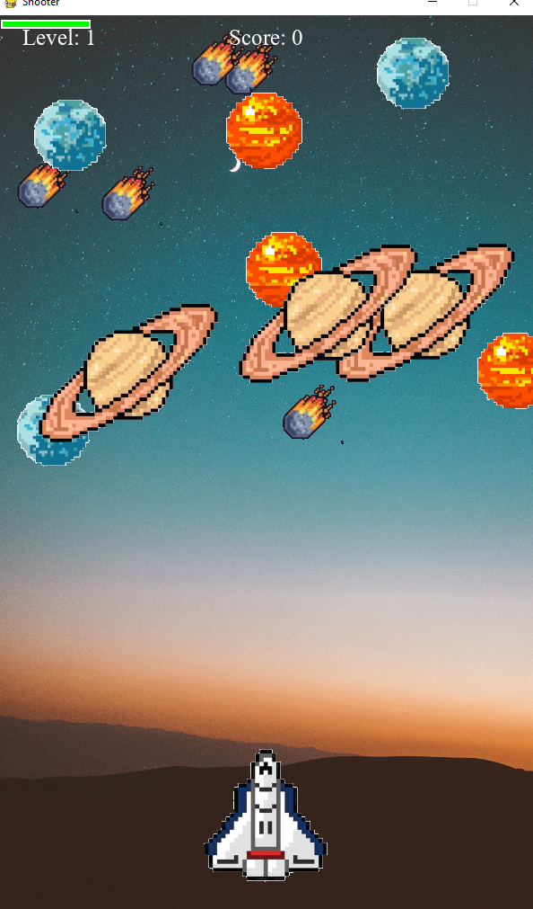

# Tothestars☀🚀

## Project description

This project is a shooting game developed with Pygame. The goal of the game is to control an advanced spacecraft that fires black holes to destroy incoming planets, stars, and comets. The more you eliminate, the more points you earn. However, you must be careful as your ship has a shield that decreases every time you collide with an enemy object. The game has three difficulty levels.

## Features

- Control the spaceship with the left and right keys.
- Shoot black holes to destroy enemy objects.
- Earn points for each enemy destroyed.
- Monitor your shield and avoid colliding with enemy objects to keep it up.
- Beat the levels and watch the game difficulty increase.

## Screenshot

## Requirements

To run the game, you will need to have Python and the Pygame library installed. You can install Pygame using pip:

pip install pygame

## How to Run

To run the game, simply run the `Game.py` file in your Python development environment:
python Game.py
## Controls

- Left key: Move the ship to the left.
- Right key: Move the ship to the right.
- Space bar: Shoot black holes.
